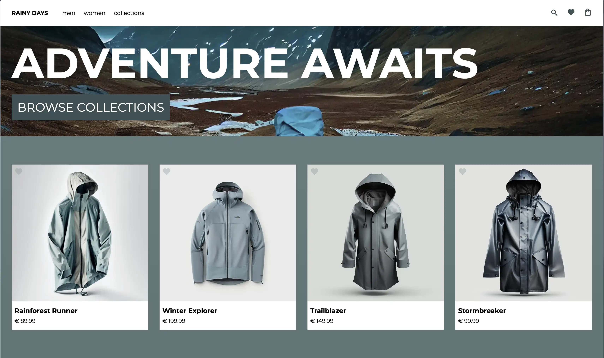

# 🌧️Rainy Days eCommerce Store🌧️

This is a modern, responsive, and efficient online store built using SvelteKit, and integrated with the WordPress WooCommerce API as its CMS.



## 🎉 Features

- Built with SvelteKit for an optimal user experience and top-notch performance
- Integrated with the WordPress WooCommerce API for easy content and product management
- Responsive design adapts to various screen sizes, from mobile to desktop
- Simple configuration using environment variables for API key and endpoint
- Straightforward installation and deployment process

## 🚀 Installation

### 📋 Requirements

- Node.js (>= 12.x)
- NPM (>= 6.x)

### 🏁 Getting Started

1. Clone the repository:

```bash
git clone https://github.com/kyrregjerstad/rainy-days-new.git
cd rainy-days-new
```

2. Install dependencies:

```bash
npm i
```

3. Create a `.env` file in the root directory by using the provided `.env.example` as a reference:

```bash
cp .env.example .env
```

4. Add your own API keys and endpoint in the `.env` file. If you don't have an API key, you can get one by installing the [WooCommerce](https://wordpress.org/plugins/woocommerce/) plugin on your WordPress site. The WooCommerce API documentation can be found here: [WooCommerce Rest API](https://woocommerce.github.io/woocommerce-rest-api-docs/).

The `.env` file should look something like this:

```bash
PUBLIC_API_BASE_URL=https://your-api-base-url.com
PRIVATE_WC_USERNAME=YourWoocommerceUsername
PRIVATE_WC_PASSWORD=YourWoocommercePassword
PRIVATE_WC_AUTH_HEADER="Basic YourWoocommerceAuthHeader"
```

5. Start the development server:

```bash
npm run dev -- --open
```

This should open your browser automatically, if not open your browser and navigate to [http://localhost:3000](http://localhost:3000) to view the app.

## 🌐 Deployment

The project is hosted at [www.rainy-days.kyrre.dev](https://www.rainy-days.kyrre.dev). I'm using [Vercel](https://vercel.com) for hosting, so no build step is required if you choose to do the same. You can also host the project on your own server, but you'll need to build the project first:

```bash
npm run build
```

## 👩‍💻 Contributing

If you'd like to contribute to the Rainy Days project, feel free to open a pull request or create an issue.

## 📄 License

This project is licensed under the MIT License - see the [LICENSE](LICENSE) file for details.

## 🙌 Acknowledgements

- [SvelteKit](https://kit.svelte.dev/)
- [WordPress](https://wordpress.org/)
- [WooCommerce API](https://woocommerce.github.io/woocommerce-rest-api-docs/)
